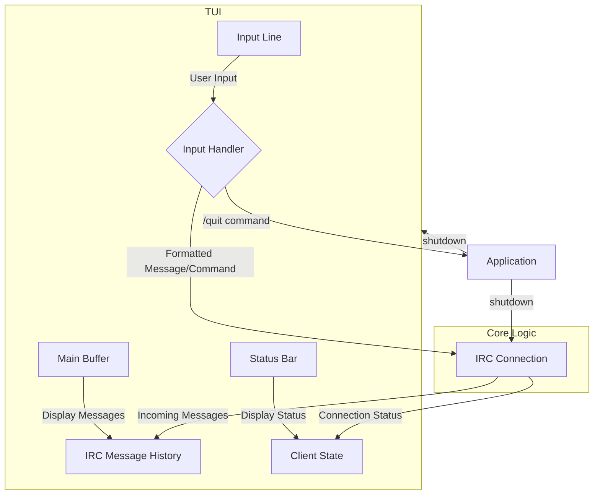

# Chatter TUI Design

This document outlines the architecture for the terminal user interface (TUI) of the Chatter IRC client.

## 1. Overview

The TUI will be built using the ncurses library to provide a rich, interactive experience within the terminal. It will be divided into three main components: a message buffer, a status bar, and an input line. The interface will handle real-time message display, user input, and basic command processing.

## 2. Components

The screen will be divided into three non-overlapping windows, each managed by ncurses.

### 2.1. Main Buffer

*   **Position:** Top section of the screen, occupying all but the bottom two lines.
*   **Functionality:** Displays incoming and outgoing IRC messages. When the buffer fills, it will scroll up to show the latest messages.
*   **Implementation:** An ncurses window with the `scrollok(win, TRUE)` option enabled. A separate data structure (e.g., a circular buffer or a linked list) will hold the message history.

### 2.2. Status Bar

*   **Position:** The second to last line of the screen.
*   **Functionality:** Displays the current status of the client, such as connection state, current channel, or notifications.
*   **Style:** It will have a distinct visual style to separate it from the other components (e.g., inverted colors).
*   **Implementation:** A single-line ncurses window. The content will be updated based on events from the IRC connection and user actions.

### 2.3. Input Line

*   **Position:** The bottom line of the screen.
*   **Functionality:** A single-line input field for the user to type messages and commands.
*   **Implementation:** A single-line ncurses window where user input is captured character by character. It will handle basic editing features like backspace.

## 3. Layout

The layout will be managed by creating three separate ncurses windows.

```
+--------------------------------------------------------------------------+
|                                                                          |
|                                Main Buffer                               |
|                           (Displays messages)                            |
|                                                                          |
|                                                                          |
|                                                                          |
|                                                                          |
|                                                                          |
|                                                                          |
+--------------------------------------------------------------------------+
| Status Bar (e.g., [Connected] #channel)                                  |
+--------------------------------------------------------------------------+
| > Input Line (User types here)                                           |
+--------------------------------------------------------------------------+
```

## 4. Data Flow

The TUI will interact with the core IRC logic through a message-passing or event-driven system.



### 4.1. Incoming Messages

1.  The `irc` module receives a message from the server.
2.  The message is processed and added to the message history data structure.
3.  The TUI's main buffer is notified of a new message.
4.  The main buffer window is refreshed, displaying the new message and scrolling if necessary.

### 4.2. User Input

1.  The user types in the input line window.
2.  The TUI captures key presses in the main event loop.
3.  Input is appended to an input buffer.
4.  On pressing `Enter`, the input buffer is processed:
    *   If it's a command (e.g., `/quit`), the command is executed locally.
    *   If it's a message, it's sent to the `irc` module to be transmitted to the server.
5.  The input line is cleared for new input.

## 5. Event Handling

The application will run in a main loop that waits for input from two sources:
1.  **User Input:** From `stdin` (managed by ncurses `getch()`).
2.  **Network Input:** From the IRC server socket.

A `select()` or `poll()` call will be used to monitor both file descriptors simultaneously, ensuring the UI remains responsive while waiting for network messages.

*   **`ctrl-c`:** A signal handler for `SIGINT` will be installed to ensure a clean shutdown of ncurses and the network connection.
*   **`/quit` command:** This will trigger the same clean shutdown procedure.

## 6. Core Implementation Plan

Here is a proposed plan for implementing the TUI.

```
- [ ] **1. Setup ncurses:** Initialize the ncurses library and create the three main windows (Main Buffer, Status Bar, Input Line).
- [ ] **2. Implement Main Loop:** Create the main event loop using `select()` or `poll()` to handle both user and network input.
- [ ] **3. Handle User Input:** Implement logic to read from the input line and process messages and commands.
- [ ] **4. Display Messages:** Connect the main buffer to the message history and render incoming messages.
- [ ] **5. Implement Status Bar:** Update the status bar with connection information.
- [ ] **6. Graceful Shutdown:** Implement signal handling for `ctrl-c` and a `/quit` command to properly close ncurses and network sockets.
```

## 7. Future Considerations

*   **Multiple Channels/Windows:** The design could be extended to support multiple chat windows or channels, perhaps using a tabbed interface.
*   **UTF-8 Support:** The ncursesw library (`-lncursesw`) should be used to handle UTF-8 characters correctly.
*   **Configuration:** Colors and other UI elements could be made configurable.