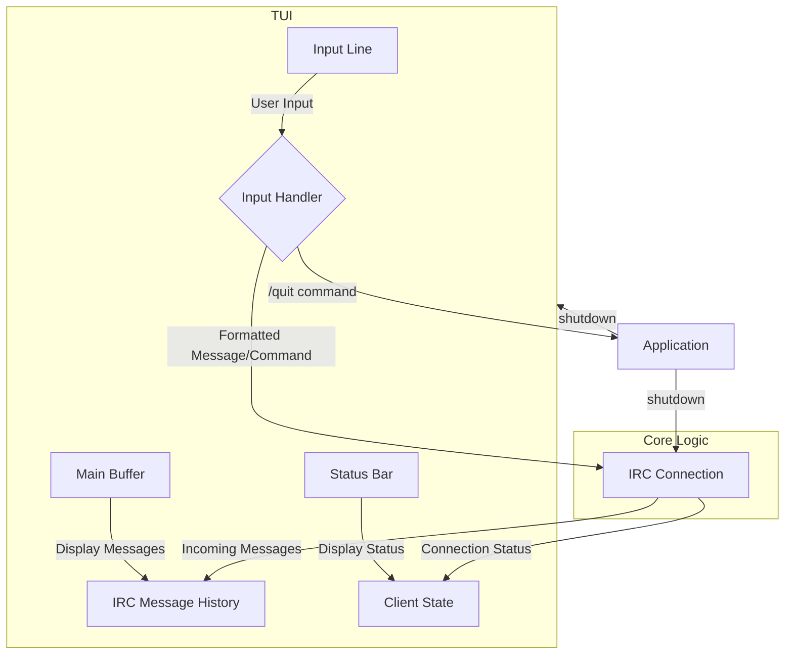

# Chatter TUI Design

This document outlines the architecture for the terminal user interface (TUI) of the Chatter IRC client.

## 1. Overview

The TUI will be built using the ncurses library to provide a rich, interactive experience within the terminal. It will be divided into three main components: a message buffer, a status bar, and an input line. The interface will handle real-time message display, user input, and basic command processing.

## 2. Components

The screen will be divided into three non-overlapping windows, each managed by ncurses.

### 2.1. Main Buffer

*   **Position:** Top section of the screen, occupying all but the bottom two lines.
*   **Functionality:** Displays incoming and outgoing IRC messages. When the buffer fills, it will scroll up to show the latest messages.
*   **Implementation:** An ncurses window with the `scrollok(win, TRUE)` option enabled. A separate data structure (e.g., a circular buffer or a linked list) will hold the message history.

### 2.2. Status Bar

*   **Position:** The second to last line of the screen.
*   **Functionality:** Displays the current status of the client, such as connection state, current channel, or notifications.
*   **Style:** It will have a distinct visual style to separate it from the other components (e.g., inverted colors).
*   **Implementation:** A single-line ncurses window. The content will be updated based on events from the IRC connection and user actions.

### 2.3. Input Line

*   **Position:** The bottom line of the screen.
*   **Functionality:** A single-line input field for the user to type messages and commands.
*   **Implementation:** A single-line ncurses window where user input is captured character by character. It will handle basic editing features like backspace.

## 3. Layout

The layout will be managed by creating three separate ncurses windows.

```
+--------------------------------------------------------------------------+
|                                                                          |
|                                Main Buffer                               |
|                           (Displays messages)                            |
|                                                                          |
|                                                                          |
|                                                                          |
|                                                                          |
|                                                                          |
|                                                                          |
+--------------------------------------------------------------------------+
| Status Bar (e.g., [Connected] #channel)                                  |
+--------------------------------------------------------------------------+
| > Input Line (User types here)                                           |
+--------------------------------------------------------------------------+
```

## 4. Data Flow

The TUI will interact with the core IRC logic through a message-passing or event-driven system.



### 4.1. Incoming Messages

1.  The `irc` module receives a message from the server.
2.  The message is processed and added to the message history data structure.
3.  The TUI's main buffer is notified of a new message.
4.  The main buffer window is refreshed, displaying the new message and scrolling if necessary.

### 4.2. User Input

1.  The user types in the input line window.
2.  The TUI captures key presses in the main event loop.
3.  Input is appended to an input buffer.
4.  On pressing `Enter`, the input buffer is processed:
    *   If it's a command (e.g., `/quit`), the command is executed locally.
    *   If it's a message, it's sent to the `irc` module to be transmitted to the server.
5.  The input line is cleared for new input.
6.  To prevent rendering artifacts and flickering, any user input that modifies the screen state triggers a full refresh of the entire TUI.

## 5. Event Handling

The application will run in a main loop that waits for input from two sources:
1.  **User Input:** From `stdin` (managed by ncurses `getch()`).
2.  **Network Input:** From the IRC server socket.

A `select()` or `poll()` call will be used to monitor both file descriptors simultaneously, ensuring the UI remains responsive while waiting for network messages. The main loop triggers a complete redraw of all windows whenever a `needs_refresh` flag is set by the input handler or the IRC message processor. This ensures the screen is always in a consistent state.

*   **`ctrl-c`:** A signal handler for `SIGINT` will be installed to ensure a clean shutdown of ncurses and the network connection.
*   **`/quit` command:** This will trigger the same clean shutdown procedure.

## 6. Core Implementation Plan

Here is a proposed plan for implementing the TUI.

```
- [ ] **1. Setup ncurses:** Initialize the ncurses library and create the three main windows (Main Buffer, Status Bar, Input Line).
- [ ] **2. Implement Main Loop:** Create the main event loop using `select()` or `poll()` to handle both user and network input.
- [ ] **3. Handle User Input:** Implement logic to read from the input line and process messages and commands.
- [ ] **4. Display Messages:** Connect the main buffer to the message history and render incoming messages.
- [ ] **5. Implement Status Bar:** Update the status bar with connection information.
- [ ] **6. Graceful Shutdown:** Implement signal handling for `ctrl-c` and a `/quit` command to properly close ncurses and network sockets.
```

## 7. Future Considerations

*   **Multiple Channels/Windows:** The design could be extended to support multiple chat windows or channels, perhaps using a tabbed interface.
*   **UTF-8 Support:** The ncursesw library (`-lncursesw`) should be used to handle UTF-8 characters correctly.
*   **Configuration:** Colors and other UI elements could be made configurable.

## 8. Buffer List Feature

To enhance modularity and user experience, the Chatter client will be updated to support multiple message buffers. This will allow users to switch between different contexts, such as the server status window and individual channel or private message conversations.

### 8.1. Data Structures

A flexible data structure will be implemented to manage the list of buffers. A doubly linked list is proposed to allow for efficient traversal in both directions (e.g., with `Alt-j` and `Alt-k` keys).

Each node in the linked list will be a `struct` representing a buffer:

```c
// Proposed for a new buffer.h header
typedef struct buffer_node {
    char *name;                 // e.g., "status", "#channel", "user"
    char **lines;               // Dynamically allocated array of strings for buffer content
    int line_count;             // Number of lines in the buffer
    int capacity;               // Current capacity of the lines array
    int active;                 // Flag (1 for active, 0 for inactive)
    struct buffer_node *prev;
    struct buffer_node *next;
} buffer_node_t;

// Global handle to the list of buffers
extern buffer_node_t *buffer_list_head;
extern buffer_node_t *active_buffer;
```

This structure will be defined in a new `buffer.h` file, and the buffer management functions will be implemented in a corresponding `buffer.c`.

### 8.2. TUI Layout Changes

The TUI layout will be updated to include a new pane on the left side of the screen to display the list of available buffers.

*   **Buffer List Pane:** A 16-character wide pane on the left, extending the full height of the terminal.
*   **Main Buffer:** Occupies the top section of the remaining screen area, to the right of the buffer list.
*   **Status Bar & Input Line:** Positioned below the main buffer, to the right of the buffer list.

The updated layout will be managed in `tui.c`.

```
+----------------+-------------------------------------------------------------+
|                |                                                             |
|  Buffer List   |                    Main Buffer                              |
| (16 chars wide,|              (Displays active buffer's content)             |
|  full height)  |                                                             |
|                |                                                             |
|                |                                                             |
|                +-------------------------------------------------------------+
|                | Status Bar (e.g., [Connected] #channel)                     |
|                +-------------------------------------------------------------+
|                | > Input Line (User types here)                              |
+----------------+-------------------------------------------------------------+
```

### 8.3. Buffer Switching

The user will be able to switch between buffers using the `Alt-j` and `Alt-k` keys.

*   **`Alt-j` (Next Buffer):** Pressing `Alt-j` will navigate to the next buffer in the
linked list. The `active` flag will be updated, and the main buffer window will be
refreshed to display the content of the newly active buffer. If the current buffer is the
end of the list, it will wrap around to the beginning.
*   **`Alt-k` (Previous Buffer):** Pressing `Alt-k` will navigate to the previous buffer in the linked list. The logic is similar to `Alt-j`, wrapping around to the end if the beginning of the list is reached.

The key handling logic will be implemented in the main event loop in `tui.c`.

### 8.4. Message Routing

A new mechanism will be introduced to route incoming messages to the appropriate buffer.

1.  **Message Capture:** The `irc.c` module will capture all incoming messages from the server (e.g., `PRIVMSG`).
2.  **Buffer Identification:** A new function, `get_buffer_for_message(char *target)`, will determine the correct buffer for the message. For instance, a message to `#chatter` goes to the `#chatter` buffer. If a buffer doesn't exist, a new one will be created.
3.  **Message Appending:** The message will be passed to a new function, `buffer_append_message(buffer_node_t *buffer, const char *message)`, which will add the message to the buffer's `lines` array, handling memory allocation as needed.
4.  **TUI Refresh:** If the message is for the currently active buffer, the main buffer window will be refreshed to display it.

### 8.5. Function Signatures

The following new or modified function signatures will be required:

**`buffer.h` (New File)**
```c
#ifndef BUFFER_H
#define BUFFER_H

// Buffer management functions
void buffer_list_init(void);
buffer_node_t* create_buffer(const char *name);
void add_buffer(buffer_node_t *buffer);
void buffer_append_message(buffer_node_t *buffer, const char *message);
buffer_node_t* get_buffer_by_name(const char *name);
void set_active_buffer(buffer_node_t *buffer);

#endif // BUFFER_H
```

**`tui.h`**
```c
// Modified functions
void tui_init(void);
void tui_draw_layout(void); // Will be updated for the new layout
void tui_refresh_main_buffer(void);
void tui_handle_input(int ch, char *input_buffer, size_t buffer_size, int *input_pos, struct Irc *irc, bool *needs_refresh);
```

**`irc.h`**
```c
// No new public functions needed, but internal logic will change to call buffer management functions.
```

This design provides a solid foundation for implementing the buffer list feature. The separation of concerns between `tui.c`, `irc.c`, and the new `buffer.c` will help maintain a clean and extensible architecture.